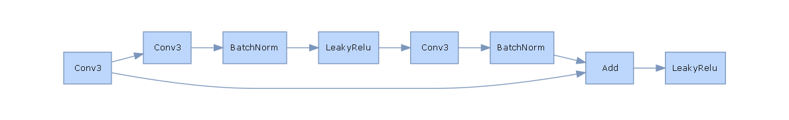

# Smart Contracts Vulnerability Classification
In this project we explored deep learning techniquess, and in particular CNNs, for the detection and classification of vulnerabilities in smart contracts deployed on the Ethereum main net.

Ethereum smart contracts are written in Solidity, which is a Turing complete programming language: this allows blockchain developers to easily implement complex business logic solutions and has been instrumental in the development of decentralized applications (dApps). However, it also allows for a bigger chance of bugs and code vulnerabilities, which can be found and then exploited by malicious users: this is a serious issue for smart contracts, because these problems cannot be patched after deployment due to the immutable nature of the ledger.

Thus, a developer should check potentially vulnerable pieces of codes before deploying its contracts using security patterns, which are expert-made and help making sure that the code is reliable (thus also helping to mitigate eventual loss of tokens and other digital assets).
However, defining security patterns requires having a deep knowledge about the internal workings of the blockchain and about Solidity code and thus it can only be done by field experts; moreover, it's a task that requires a lot of time and effort, especially considering the rates at which new potentially exploitable vulnerabilities are discovered.
For this reason, automated vulnerability detection tools were proposed: the majority rely on symbolic execution (Oyente, Mythril) or are rule-based (Slither, Smartcheck). These tools are able to reach an high detection accuracy for known bugs but they are either too time consumning (symbolic execution) or rely on expert-made dectection rules, thus not resolving our problem. This is why researchers are now investigating ML and DL-based techniques, proposing solutions that are usually fast and do not rely on an heavy feature engineering phase.

Deep Learning techniques based on CNNs have long since shown good results in malware detection and classification: the malware executable is transformed into a grayscale image, which is then fed into a convolutional architecture in order to extract relevant features and pattern. A final linear classification head usually takes care of predicting the malware class or declaring the program safe for use. Seeing as there are a number of similarities between a program's executable file and the bytecode of a smart contract, investigating whether similar techniques could also be useful for detecting vulnerabilities in Solidity code is a new and active area of research [[1]](#1)[[2]](#2).

- [Smart Contracts Vulnerability Classification](#smart-contracts-vulnerability-classification)
  - [Dataset](#dataset)
  - [Models](#models)
    - [LSTM baseline](#lstm-baseline)
    - [Conv2D models](#conv2d-models)
    - [Conv1D model](#conv1d-model)
  - [Results and error analysis](#results-and-error-analysis)
  - [How to install](#how-to-install)
  - [References](#references)

## Dataset

Since this is a relatively new research area, there are not many open source datasets of labeled smart contracts and most of them are quite small. Two of them are the SmartBugs [[5]](#5) wild and the ScrawlID [[4]](#4) datasets: they both were labeled using different tools and thus reduce the probability of false-positives (i.e.: contracts where a tool found a vulnerability that's not really there). However, they only contain 6.7k and 47k elements, respectively, making them quite small for training a deep model from scratch.
This is the main reson why we decided to put together and release our own large-scale dataset, which is available on the [HuggingFace hub](https://huggingface.co/datasets/mwritescode/slither-audited-smart-contracts) 🤗. More details about the dataset contrunction can be found [here](https://huggingface.co/datasets/mwritescode/slither-audited-smart-contracts) and at it's [GitHub repo](https://github.com/mwritescode/slither-audited-smart-contracts). The dataset is composed of more than 100k smart contracts which were labeled using the Slither static analyzer: this tool passes the code though a number of rule-based detectors and returns a JSON file containing details about where those detectors found a vulnerability. The 38 detectors that found a match in our dataset were then mapped to the following 5 classes that were. Again, more details about how this mapping was created can be found at the [dataset page](https://huggingface.co/datasets/mwritescode/slither-audited-smart-contracts).

- `access-control`: this type of issues is common in all programs, not just in those that run on the blockchain. Usually a contract's functionality is accessed through its public or external functions but if the visibility of some fields / functions is not correctly set to private, malicious users could have access to them.
- `arithmetic`: prevalently related to integer underflow and overflow, which are particularly dangerous vulnerabilities in smart contracts where unsigned integers are orevalent. In case of overflow, many benevolent pieces of code may be turned into tools for DoS attacks and theft.
- `reentrancy`: probably the most famous Ethereum vulnerability. It occours when a call to an external contract is allowed to make new calls to the calling contract before the initial execution is complete. This means that the contract state may change in the middle of the execution of a function.
- `unchecked-calls`: Solidity offers some low-level functions like `call()`, `callcode()`, `delegatedcall()` and `send()` which do not propagate errors. These functions simply return false, but the code will continue to run; thus developers should always check the return value of such low-level calls. Note that, in alignment to what they did for [SmartBugs Wild](https://github.com/smartbugs/smartbugs-results/blob/master/metadata/vulnerabilities_mapping.csv) we also include in this category the results of the Slither detector `unused-return`, which checks if the return value of an external call is not stored in a local or state variable.
- `others`: this class groups together the results of all the other relevant Solidity detectors that were not included in the previous classes. Examples are `uninitialized-state`, which checks whether the contract has some uninitialized state variables, `incorrect-equality`, which checks whether strict equalities were used to determine if an account has enough Ether or tokens (something that can be easily manipulated by an attacker) and `backdoor`, which simply detects the presence of a function called "backdoor".

Once we have the contract bytecode, we can use it to produce an RGB image with a procedure similar to what is done in [[1]](#1): suppose we have the piece of bytecode 606080, then in the RGB image the three channels will be (R:60, G:60, B:80). Some of the images produced with this techniques are shown below; note that when passing them as input to our CNNs we actually center crop and resize them in order to achieve a single image size. A sample batch is displayed below.


## Models

We experimented with two main types of architectures:

- traditional 2D CNNs applied to the RGB images corresponding to contract bytecode (which were created as described above)
- 1D CNNs applied directly to the contract bytecode, which was treated as a signal and normalized to be between -1 and 1.

Moreover, we compared our results to those of a baseline LSTM model, which was again trained only on the sequences of opcodes in the contract bytecode. More details about each of the architecures we tried are given below.

### LSTM baseline

This is a simple network composed of an Embedding layer, which was trained from scratch to produce an embedding for each opcode, three stacked bidirectional LSTM layers and two linear layers that served as the classification head. These linear layer took as input the concatenation of the final hidden states of the last forward and backward LSTM and computed the prediction.

### Conv2D models

For the 2D CNN models we simply used two common models coming from the computer vision literature, speecifically ResNet-18 and Inception v3. The ResNet model was chosen as a sort of baseline convolutional model, while the Inception network was selected because it is widely used and obtains good results malware detection and classification according to the literature.

Note that both models were not trained from scratch but initialized from ImageNet weights: indeed, literature on malware classification showed that this pre-training is useful and improves performance even on domains which are quite different from the original ImageNet one.

### Conv1D model

Finally, some literature [[2]](#2) [[3]](#3) suggested that 1D convolutions may be a good fit for this task. Indeed,

- traditional 2D CNNs are structured in such a way that the shallow layers capture low-level features which then get aggregated into high-level ones in subsequent layers. However, the patterns which are interesting and useful to detect code vulnerability are most likely low-level pixel-by-pixel ones. In practice, as the network grows deeper we tend to lose some of the pixel-level information. As a result, semantics and context of the smart contract can be destroyed.
- At the same time, applying 1D convolutions over the contract bytecode used as a signal (i.e.: not reshaped as an RGB image) may be better equipped to maintain these informations.

Thus, we implemented and tested also a ResNet-inspired 1D convultional neural network: the first of the below pictures shows how we defined the 1D ResBlock, while the second one shows the architecture as a whole.

<p align="center">



</p>

## Results and error analysis

We tried different training configurations for every model type varying:

- the learning rate
- the eventual l2 penalty
- the optimizer (Adam or SGD)
- the stats used when normalizing RGB images (either coputed ad-hoc or ImageNet)
- which layers were fin-tuned and which, if any, were kept fixed
- the loss (either binary-crossentropy or focal loss)
- the use of class weights

The below table reports the best results we were able to achieve on the validation set for every architecture. Note that in this context where every elemen can be in more than one class and the class labels are not really balanced the accuracy is not an ideal metric to use. Indeed, we also consider a micro-averaged version of the F1 score, which aggregates the contributions of all classes to compute the average metric and thus treats the examples of each class with equal weight.
<p align="center">

| Model name  | Accuracy | Micro F1 |
| :---: | :---: | :---: |
| ResNet1D  | 0.7353 | 0.8381 |
| ResNet  | 0.6841  | 0.7928 |
| Inception | 0.6988 | 0.8015 |
| LSTM Baseline | 0.6934 | 0.7953 |

</p>

We can immediately see that the LSTM baseline obtains poor results; this is probably due to the fact that we cut the bytecode to just 512 opcodes for resons due to limited memory and computational resources. However, our [data analysis](https://github.com/mwritescode/slither-audited-smart-contracts/blob/main/exploratory_data_analysis.ipynb) shows that most bytecodes have a lenght of about 5000 opcodes, meaning that the portion we use probably corresponds to only a small first portion of the contract code.

2D CNNs have the avdantage not to require the input to be truncated in any way: we first create the images using all the bytecode and then simply resize them as needed. However, they have the disadvantages discussed above, which may make them not an ideal choice for this task: indeed, patterns for code vulnerability detection in Solidity may be at the level of a small sequence of opcodes only and thus may be missed when using strided convolutions. Indeed, literature in malware classification shows that malicious code patterns in that domain are usually much bigger and easier to detect even to the human eye.

Note that, the 1D convolutional network instead again requires the input to be cut off: however, the nature of the network lets us use a bigger maximum length of 16384 (corresponding to a flattened 128x128 image). Sill, as shown in the table above, this architecture is the one that achieves the best results.

We show below the confusion matrices relative to the performance of our best model on the test set. They show that the class `unchecked-calls` has very few misclassified examples, while the percentage of errors greatly increases when we consider the other classes. This is predictable, because `unchecked-calls` is a vulnerability which is present in more than 35000 of the original train contracts, thus making it very much the majority class. Among the other classes, we notice that the two with fewer training examples (namely `access-control` and `arithmetic`) are where our classifier makes most errors. Finally, classes `other` and `reentrancy` have more or less the same number of samples in the training set but the first one is misclassified a lot more: this is probably due to the inherent nature of this class, which groups all the interesting vulnerabilities that are not part of the other four classes. This variety may indeed generate some confusion for the detector.


## How to install
In order to run this code on your machine, simply code the repository with:
```sh
git clone https://github.com/mwritescode/smart-contracts-vulnerabilities.git
```

then install `torch` and `torchvision` with CUDA support according to your system's requirements (see [Pytorch docs](https://pytorch.org/get-started/locally/) for more info). Finally, you can install all the other project requirements by running the following commands from the folder _smart-contracts-vulnerabilities_.
```sh
pip install -U pip
pip install -r requirements.txt
```

In order to start a training, simply create a .yaml config file according to [these](https://github.com/mwritescode/smart-contracts-vulnerabilities/blob/main/docs/config.md) specifications and then run

```sh
python main.py --cfg_path path/to/your/config/file.yaml
```

## References
<a id="1">[1]</a> Huang, T. H.-D. (2018). Hunting the Ethereum Smart Contract: Color-inspired Inspection of Potential Attacks. ArXiv:1807.01868 [Cs]. http://arxiv.org/abs/1807.01868

<a id="2">[2]</a> Hwang, S.-J., Choi, S.-H., Shin, J., & Choi, Y.-H. (2022). CodeNet: Code-Targeted Convolutional Neural Network Architecture for Smart Contract Vulneratbility Detection. IEEE Access, 1–1. https://doi.org/10.1109/ACCESS.2022.3162065

<a id="3">[3]</a> Lin, W.-C., & Yeh, Y.-R. (2022). Efficient Malware Classification by Binary Sequences with One-Dimensional Convolutional Neural Networks. Mathematics, 10(4), 608. https://doi.org/10.3390/math10040608

<a id="4">[4]</a> Yashavant, C. S., Kumar, S., & Karkare, A. (2022). ScrawlD: A Dataset of Real World Ethereum Smart Contracts Labelled with Vulnerabilities. ArXiv:2202.11409 [Cs]. http://arxiv.org/abs/2202.11409

<a id="5">[5]</a> Durieux, T., Ferreira, J. F., Abreu, R., & Cruz, P. (2020). Empirical Review of Automated Analysis Tools on 47,587 Ethereum Smart Contracts. Proceedings of the ACM/IEEE 42nd International Conference on Software Engineering, 530–541. https://doi.org/10.1145/3377811.3380364